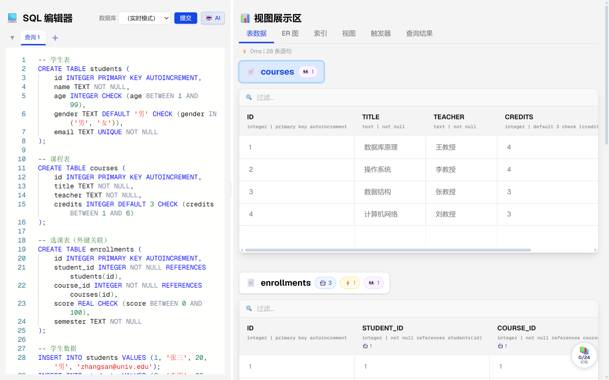
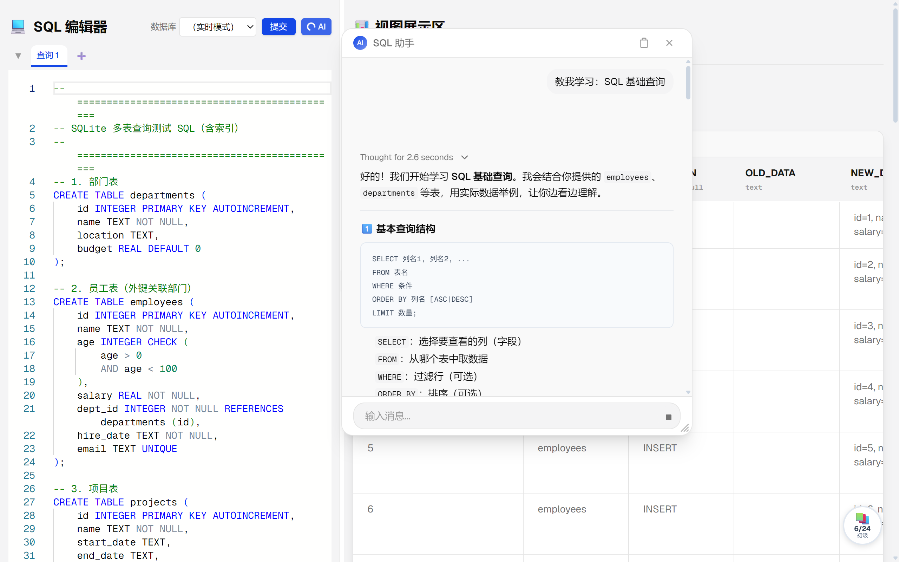
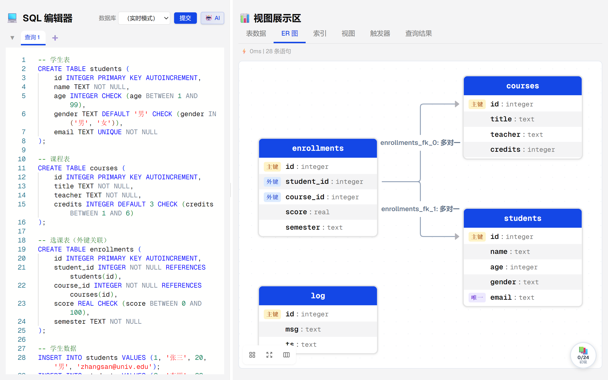
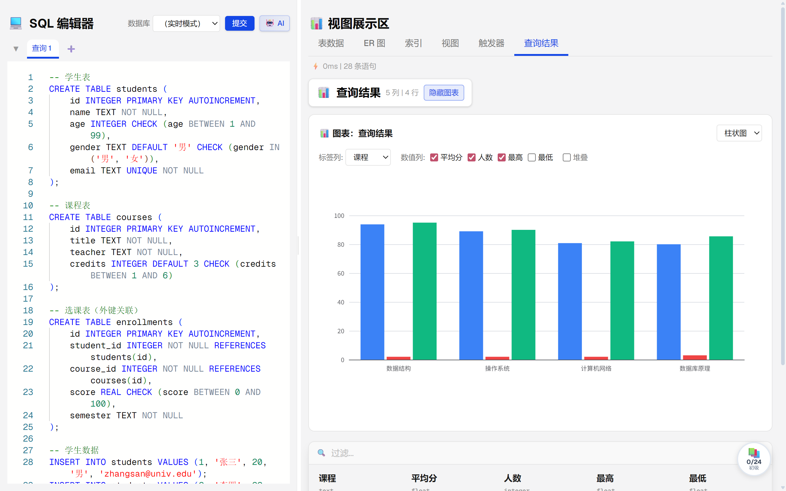
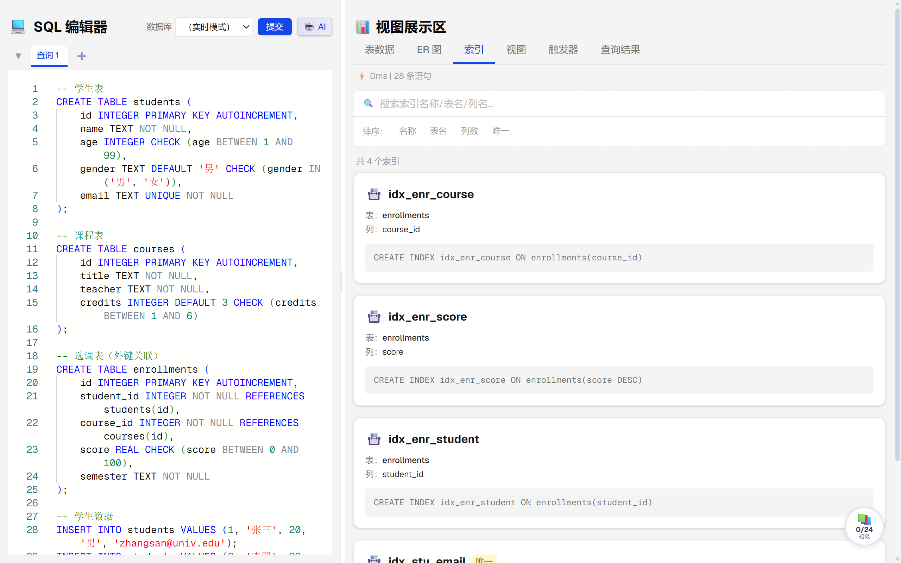
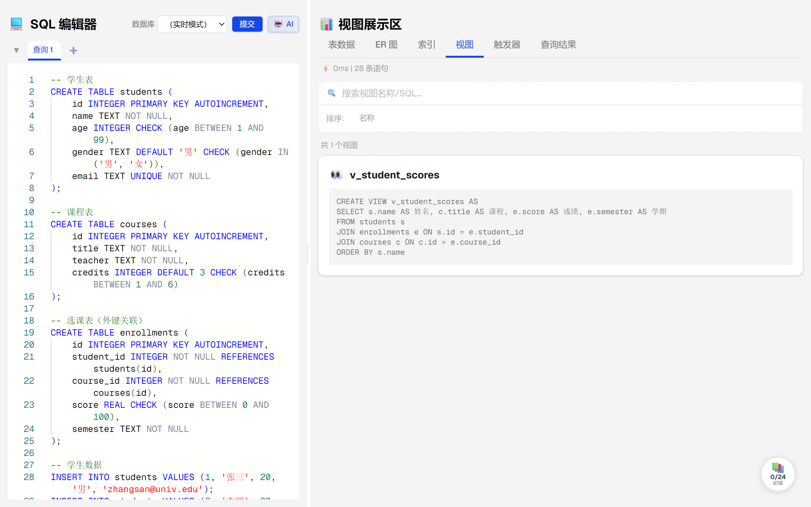
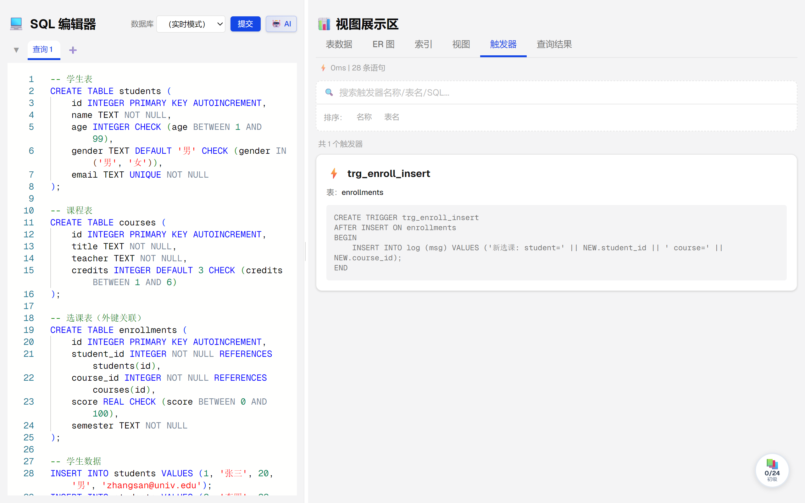
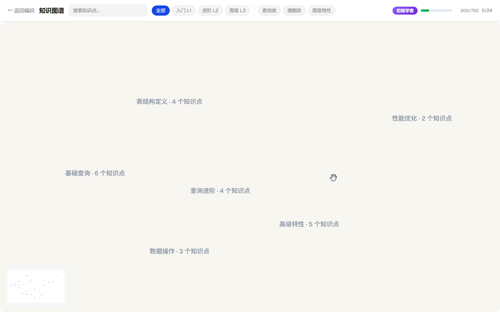
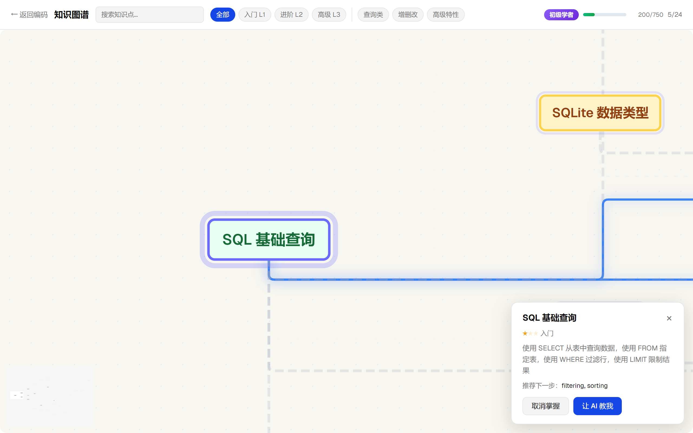

# SQLive — 全栈 SQL 交互式学习平台

左侧 Monaco 编辑器编写 SQL → 右侧表格即时展示结果。在表格中编辑数据，自动反向修改 SQL 源码，两侧始终保持一致。支持 AI 辅助编写、多 Tab 隔离运行、ER 图与知识图谱导航。专为 SQL 教学场景研发。学生开浏览器即用，无需搭建本地环境；AI 对话解释 SQL 语义，充当即时辅导；知识图谱引导学习路径，避免盲目刷题。



## 功能特性

### 编辑器 ↔ 视图双向同步

- 在右侧表格中编辑任意单元格，系统自动定位并修改左侧 SQL 对应位置，始终保持两端一致。
- 修改出错时自动回滚到上一条正确 SQL，不影响当前工作。

### AI 即时辅导

- 切换 AI 后端（DeepSeek、OpenAI 兼容、Ollama、LM Studio），对话解释 SQL 语义、分析错误原因，充当即时辅导，流式输出逐字显示。
- 新增提供商只需实现一个接口，不影响已有代码。



### 多 Tab 隔离 + ER 图导航

- 每个浏览器 Tab 拥有独立的 SQLite 内存数据库，空闲自动回收。
- 根据建表语句自动生成 ER 图，展示表间外键关系，点击节点即可跳转浏览对应表数据。



### 数据可视化

- 表格支持排序、过滤、分页，查询结果可用柱状图、折线图、饼图展示。
- 浏览索引、视图、触发器、外键关系等数据库元数据。






### 结构化学习路径

- 24 个 SQL 知识点按前置关系排列，学生知道从哪开始、下一步学什么，追踪每个知识点的学习进度。




## 关键设计决策

### 范围取舍

| 决策 | 选择 | 理由 |
|---|---|---|
| 安全加固范围 | 仅做 ATTACH 禁用 + 日志脱敏 | CORS 端口收窄需要确定部署端口，当前仅本地开发 |
| 性能优化 | 移出 v1 范围 | 当前规模未触及瓶颈，优先修正确性问题 |
| 前端解析器统一 | 采用后端暴露 canonical 边界 | 避免维护两份解析器，从根源消除不一致 |
| 增量 UPDATE | 不做 | 架构变更大，全脚本重执行够用 |
| AI 流式非阻塞化 | 不做 | Tomcat 默认 200 线程够用 |

### 后端架构

- **统一 SQL 解析器**：前端不再独立解析，改用后端返回的 canonical 语句边界（start/end 偏移）——消除"前后端两份解析器在 `BEGIN...END` / `CASE...END` 上分歧导致内联编辑静默失败"的系统性 bug。
- **数据库会话 LRU 淘汰**：`LinkedHashMap` access-order + synchronized，20min 空闲超时 + 5min 定时清理，替代 `ConcurrentHashMap` 随机淘汰——多 tab 用户最久空闲的会话先被回收，而非随机踢出。
- **FK 安全清理**：`clearDatabase()` 拓扑排序按 FK 依赖顺序 DROP 表，不再开关 `PRAGMA foreign_keys`——消除并发 reset+insert 下的外键竞争。
- **SQL 沙箱**：阻断 `ATTACH DATABASE` + 关闭 `PRAGMA trusted_schema`，在 `SqlExecutionService` 层而非 SQLite authorizer 层拦截——防止用户读写服务器文件系统。
- **AI 超时统一**：`connect=5s, read=60s, write=30s`，按 provider 类型区分流式/非流式——慢或不可达的 provider 不再耗尽线程池。
- **日志脱敏**：AI provider 错误日志中的 `Authorization` header 显示为 `[REDACTED]`，防止 API key 泄露。

### 前端体验

- **知识图谱"按需浮现"连线**：默认隐藏 24 节点的依赖关系，hover 节点才显示——在"必须保留依赖信息"和"全显示太杂乱"之间取平衡，参考 Duolingo 路径感。
- **Continuous LOD**：用连续 opacity 函数替代 `v-if/v-else` DOM 切换——解决缩放时的 destroy/recreate 卡顿，实现 Google Maps 式平滑过渡。
- **原神式任务追踪**：双面板任务日志 + 冒险之证章节体系 + HUD 追踪器 + 红点通知——把"学习路径"从被动浏览变成主动探索的游戏化体验。

## 交互与体验亮点

### 编辑器 ↔ 表格双向同步

- 在表格中编辑任意单元格，系统自动定位并改写左侧 SQL 源码对应位置，两端始终一致。
- 出错自动回滚到上一条有效 SQL，不打断当前工作。
- VARCHAR 截断不再静默，弹出 tooltip 告知用户。
- 插入失败保留幽灵行输入状态，不清空，允许修正后重试。

### 知识图谱探索（原神地图风格 + Duolingo 路径感）

- 默认隐藏依赖连线，hover 节点才浮现关联边 + 高亮关联节点 + dim 无关节点。
- Ctrl+F 弹出搜索框，输入关键词匹配节点脉冲，回车镜头飞行到目标。
- 点击节点展示完整前置链 + 后继链（蓝色高亮），minimap 同步标记。
- 难度/类别筛选 chips 可组合使用，非匹配节点 dimmed。
- Concave hull 不规则多边形区域背景包裹同 category 节点，大地色系 + 高斯羽化无硬边界。
- 道路式连线：柔和点线默认可见（opacity 0.18），hover 实线 `#6366f1`，无箭头。
- 4 级 zoom 分层：全景（只看区域+标签）→ dot → compact → expanded（看描述）。
- 双击画布空白 fit-view 重置，zoom 位置 localStorage 记忆。

### Continuous LOD（连续细节层级）

用连续 opacity 分段线性函数替代 `v-if/v-else` DOM 切换。三层 dot/label/desc 共存于 DOM，缩放时平滑过渡，无 destroy/recreate 卡顿。

### 游戏化学习反馈

- 标记掌握节点 → 彩色火花粒子动画。
- 成就 toast + 连胜计数，5 连击触发特殊文案。
- XP 系统 + 等级（初级学者 → SQL 大师 → 数据库传奇），升级全屏撒花。
- 顶部进度条实时推进。

### 原神式任务追踪

- 双面板任务日志：左侧分类（核心金 / 深度学习蓝 / 每日练习紫）+ 右侧任务详情 + 步骤进度。
- 冒险之证章节体系：6 章（基础 → 查询 → DDL → DML → 进阶 → 性能），等级解锁 + 进度条 + 章完成奖励。
- HUD 任务追踪器：置顶任务显示当前步骤 + 继续学习按钮。
- 红点层级穿透：面板 → 分类 → 任务，浏览即消，不改变任务状态。
- 子步骤 locked → active → done，垂直步骤线 + 脉冲动画 + 完成打勾。

### 防御性 UX

- 浏览器刷新/崩溃后弹出"会话已恢复" toast，而非默默重置。
- ER 图面板重新打开后节点位置不归零，保持 dagre 计算的坐标。
- 多 tab 每个独立 SQLite 内存库 + LRU 空闲回收，用户感知不到资源竞争。

### JetBrains 风格 hover 预览

不是普通 tooltip，而是 Teleport 到 body 的浮窗，带标题栏 + 内嵌过滤器 + 键盘导航，IDE 风格的"hover 即查"体验。

## 演进路线

| Phase | 主题 | 关键产出 |
|---|---|---|
| 1 | Backend Infrastructure | LRU 淘汰、AI 超时、volatile 修复、日志脱敏、警告抑制精确化 |
| 2 | Parser Unification & Data Layer | canonical 语句边界、FK 安全 clearDatabase、dbName 校验统一 |
| 3 | Frontend Reliability | Emit 类型安全、VARCHAR 截断告警、幽灵行保留、ER 位置持久化 |
| 4 | Security Hardening | ATTACH/PRAGMA 阻断、SQL 沙箱 |
| 5 | Knowledge Graph UX | Hover 浮现、Ctrl+F 飞行、游戏化反馈、原神地图风格 |
| 6 | Test Debt Repair | 267 处 waitForTimeout 替换为事件等待、conditional assertion 修复 |
| 7 | User Flow Tests | 10 个 E2E spec 加真实断言 |
| 8 | Coverage Boost | 单元测试覆盖率达标 60% |
| 9 | Knowledge Task Tracking | 原神任务系统、章节进度、HUD 追踪 |
| 10 | Knowledge Graph Refactor | 16 问题修复、组件拆分 4 composable |
| 11 | Code Review Fixes | 19 项审查 findings 零遗留 |

11 个 phase / 43 个 plan / 100% 完成（2026-05-29 → 2026-06-25）。

使用 GSD（Get Stuff Done）工作流：research → requirements → roadmap → 每 phase `CONTEXT → RESEARCH → PLAN → 实施 → VERIFICATION → REVIEW`，带自动 code review + security audit 闭环，分支策略 `gsd/phase-{N}-{slug}`。

## 技术栈

| 层 | 技术 | 版本 |
|---|------|------|
| 前端框架 | Vue 3 (Composition API) | 3.5 |
| 构建工具 | Vite | 8.x |
| 样式 | Tailwind CSS | 4.x |
| 代码编辑器 | Monaco Editor | 0.55 |
| UI 组件 | Reka-ui (Radix Vue) | 2.x |
| ER 图 | Vue Flow + dagre | 1.48 / 0.8 |
| 图表 | ECharts | 5.x |
| AI 流式 | Vercel AI SDK | 6.x |
| 后端框架 | Spring Boot | 4.0.6 |
| JDK | Java 21 (Zulu) | 21 |
| 数据库 | SQLite (内存模式) | 3.51 |
| 连接池 | HikariCP | — |
| 响应式 | Spring WebFlux (Project Reactor) | — |
| 测试 | Vitest + Playwright / JUnit 5 | — |

## 快速开始

### 环境要求

- **JDK 21**（推荐 Zulu JDK 21）
- **Node.js** 18+
- **npm** 9+

### 1. 启动后端

```bash
cd sqlive-backend

# Windows（指定 JDK 路径）
set JAVA_HOME=C:\Program Files\Zulu\zulu-21
gradlew.bat bootRun

# Linux / macOS
./gradlew bootRun
```

后端运行在 `http://localhost:8080`。

### 2. 启动前端

```bash
cd sqlive-frontend

# 安装依赖（首次运行）
npm install

# 启动开发服务器
npm run dev
```

前端运行在 `http://localhost:5173`，API 请求通过 `VITE_API_URL` 环境变量直接连接后端 8080 端口。

### 3. 配置 AI（可选）

编辑 `sqlive-backend/src/main/resources/application.yml` 中 `ai.provider` 字段切换 AI 提供商：

```yaml
ai:
  provider: deepseek        # 可选: deepseek | openai-compatible | ollama | lmstudio
  providers:
    deepseek:
      api-key: ${DEEPSEEK_API_KEY:}
      model: deepseek-v4-flash
```

默认使用 DeepSeek，需设置环境变量 `DEEPSEEK_API_KEY`。仅使用 SQL 执行功能则可跳过此步骤。


## 测试

```bash
# 前端单元测试
cd sqlive-frontend
npm test                 # 运行全部 476 个 Vitest 用例
npm run test:e2e         # Playwright E2E 测试

# 后端测试
cd sqlive-backend
./gradlew test         # 运行全部 JUnit 5 用例
```

## 安装步骤

```bash
# 前端依赖
cd sqlive-frontend && npm install

# 后端依赖（首次运行或构建 jar）
cd ../sqlive-backend
./gradlew build      # Linux / macOS
gradlew.bat build    # Windows
```

## 使用示例

### 示例 1：通过 API 执行 SQL

后端运行后，可直接通过 HTTP API 执行任意 SQL 脚本：

```bash
curl -X POST http://localhost:8080/api/execute \
  -H "Content-Type: application/json" \
  -d '{
    "sql": "CREATE TABLE users (id INTEGER PRIMARY KEY, name TEXT);\nINSERT INTO users VALUES (1, '\''Alice'\'');\nSELECT * FROM users;",
    "dbName": "demo",
    "reset": true
  }'
```

成功时返回表结构、列类型和数据行：

```json
{
  "success": true,
  "data": {
    "tables": [
      {
        "name": "users",
        "columns": ["id", "name"],
        "columnTypes": { "id": "INTEGER", "name": "TEXT" },
        "data": [{ "id": 1, "name": "Alice" }]
      }
    ]
  }
}
```

### 示例 2：多表 JOIN 查询（Web 界面）

在 Web 编辑器中编写以下 SQL，左侧输入、右侧实时渲染：

```sql
CREATE TABLE departments (id INTEGER PRIMARY KEY, name TEXT);
CREATE TABLE employees (id INTEGER PRIMARY KEY, name TEXT, dept_id INTEGER, salary REAL);

INSERT INTO departments VALUES (1, '技术部'), (2, '市场部');
INSERT INTO employees VALUES (1, '张三', 1, 15000), (2, '李四', 2, 12000), (3, '王五', 1, 18000);

-- 联合查询：员工姓名 + 部门名称
SELECT e.name AS 员工, d.name AS 部门, e.salary AS 薪资
FROM employees e
JOIN departments d ON e.dept_id = d.id
ORDER BY e.salary DESC;
```

执行后在右侧"表格"标签页看到查询结果，在"ER 图"标签页看到自动生成的实体关系图（employees -- departments，1:N 关系）。

### 示例 3：批量导入 SQL 文件

项目根目录提供了 `test-multi-table.sql` 示例文件，包含 14 张表、10 个索引、4 个视图、7 个触发器、8 条 INSERT 数据以及 20+ 种查询类型（窗口函数、递归 CTE、子查询、UNION 等）。可通过 Web 界面的"导入"按钮加载，一键体验全部功能。

## 许可证

[Apache 2.0](LICENSE)
