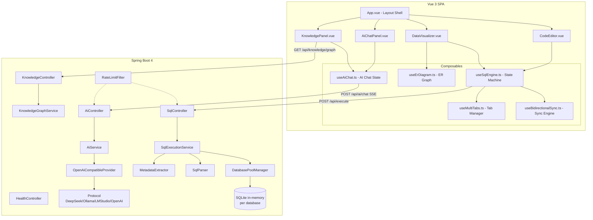

<!-- generated-by: gsd-doc-writer -->
# Architecture

## System overview

SQLive is a full-stack interactive SQL learning platform. Users write SQL in a Monaco code editor (left pane),
and the system executes the script against an isolated in-memory SQLite database, rendering resulting
tables, metadata, and ER diagrams in real time (right pane). The architecture follows a client-server
layered model: a Vue 3 single-page application communicates with a Spring Boot 4 backend over REST
(`POST /api/execute`) and SSE-based streaming (`POST /api/ai/chat`). The backend maintains one SQLite
in-memory database per user tab, frontend state is managed through a finite-state-machine composable that
coordinates code edits, API execution, metadata hydration, and bidirectional sync between visual data
edits and SQL source.

## Component diagram



## Data flow

### SQL execution pipeline

1. **User types** in `CodeEditor.vue` (Monaco Editor).
2. `useSqlEngine.ts` watches `code` with a 1-second debounce via `@vueuse/core` `useDebounceFn`.
3. When the debounce fires, a `POST /api/execute` request is sent with `{ sql, dbName, reset }` payload.
4. `SqlController.executeSql()` delegates to `SqlExecutionService.execute()`.
5. `SqlExecutionService`:
   - Obtains a `JdbcTemplate` for the requested `dbName` from `DatabasePoolManager` (creates one if new, up to 20 max).
   - If `reset=true`, drops all user-created objects (views, triggers, tables) in topological order via `clearDatabase()`.
   - Parses the script with `SqlParser.parseStatementsPrecise()` — a hand-written tokenizer that tracks `BEGIN`/`END` depth, `CASE`/`END` depth, and quote state for correct statement boundary detection.
   - Iterates over parsed statements, checking each against a blocked list (`ATTACH DATABASE`, `PRAGMA` are denied for security).
   - Executes each statement through `JdbcTemplate.execute(StatementCallback)`, collecting `ResultSet` output into `TableSchema` objects as query results.
   - After all statements, calls `MetadataExtractor` to collect full schema: tables, indexes, views, triggers, and foreign keys from `sqlite_master`.
   - Returns `SqlResponse` with `DataPayload` containing all metadata, query results, and `CanonicalStatement` position markers.
6. `useSqlEngine.ts` receives the response and hydrates the reactive `db` model (`tables`, `queryResults`, `indexes`, `views`, `triggers`, `foreignKeys`).
7. `DataVisualizer.vue` renders data tables with sorting/filtering/pagination (`TableSection.vue`), ER diagram via Vue Flow (`ErDiagram.vue`), and chart views (`ChartView.vue` via ECharts).

### Bidirectional sync pipeline (cell edit)

1. User edits a cell in `TableSection.vue` — emits `@update-cell` with `{ tableName, oldRow, newRow }`.
2. `App.vue` calls `engine.updateRow(tableName, oldRow, newRow)`.
3. `useBidirectionalSync.updateRow()` enters `reconciling` mode:
   - Saves `lastValidCode` for rollback.
   - Retrieves `CanonicalStatement` position markers (returned from the backend).
   - Uses `extractTuplesWithDepth()` and `findTupleInBatch()` to locate the exact `VALUES (...)` tuple in the SQL source that corresponds to the edited row.
   - Replaces the old tuple with a new one generated by `generateValuesTuple()` (which applies type constraints via `enforceTypeConstraints()`).
   - Sets the new `code`, which triggers execution.
4. If the execution succeeds, the engine returns to `user` mode. If it fails, the engine transitions to `rollback` mode and restores `lastValidCode`.

### AI streaming pipeline

1. User sends a message in `AiChatPanel.vue` or triggers an inline action (error analysis, fix code, explain, optimize).
2. `useAiChat.sendMessage()` constructs the SSE request to `POST /api/ai/chat`.
3. `AiController.chat()` calls `AiService.streamChat()` which delegates to `OpenAiCompatibleProvider.streamChat()`.
4. The provider uses `WebClient` (Spring WebFlux) to send the chat request to the configured AI backend (DeepSeek, Ollama, LM Studio, or OpenAI-compatible).
5. The response is streamed back as `text/event-stream`, with chunk types: `text`, `reasoning`, `usage`, `done`, `error`.
6. `useAiStreaming` parses the SSE stream via `readSseStream()` in `sse.ts` and calls the chunk handler.
7. The assistant message is progressively rendered in `AiChatPanel.vue` with support for reasoning content display and token usage tracking.

## Key abstractions

| Abstraction | Description | Location |
|---|---|---|
| `useSqlEngine` | Core state machine managing SQL execution, debounced auto-submit, error handling, and rollback. Three modes: `user`, `reconciling`, `rollback`. | `sqlive-frontend/src/composables/useSqlEngine.ts` |
| `useBidirectionalSync` | Reverse-engineers cell edits back into SQL source. Replaces `VALUES` tuples, inserts/deletes rows, creates/drops tables. | `sqlive-frontend/src/composables/useBidirectionalSync.ts` |
| `useMultiTabs` | Manages multiple independent SQL editor tabs, each with its own code buffer, database name, and dirty state. | `sqlive-frontend/src/composables/useMultiTabs.ts` |
| `useAiChat` | AI chat state: message history, SSE streaming, auto-error-analysis trigger, message CRUD. | `sqlive-frontend/src/composables/useAiChat.ts` |
| `useErDiagram` | Converts table schemas and foreign keys into Vue Flow nodes/edges, computes layout via dagre, and derives cardinality labels. | `sqlive-frontend/src/composables/useErDiagram.ts` |
| `DatabasePoolManager` | Manages isolated in-memory SQLite databases per user tab using `ConcurrentHashMap<String, JdbcTemplate>`. Max 20 databases; evicts after 20 min idle. | `sqlive-backend/src/main/java/com/douzi/sqlive/service/database/DatabasePoolManager.java` |
| `SqlExecutionService` | Orchestrates parsing, security blocking, execution, metadata collection, and response construction for SQL scripts. | `sqlive-backend/src/main/java/com/douzi/sqlive/service/SqlExecutionService.java` |
| `SqlParser` | Hand-written SQL statement boundary parser. Tracks `BEGIN`/`END` depth, `CASE`/`END` depth, single/double quote states, and nested comments. | `sqlive-backend/src/main/java/com/douzi/sqlive/service/sql/SqlParser.java` |
| `MetadataExtractor` | Extracts 7 categories of metadata from `sqlite_master`: tables, indexes, views, triggers, foreign keys, column constraints, and query result schemas. | `sqlive-backend/src/main/java/com/douzi/sqlive/service/metadata/MetadataExtractor.java` |
| `AiProvider` / `OpenAiCompatibleProvider` | Pluggable AI provider interface with protocol abstraction. Supports DeepSeek, Ollama, LM Studio, and OpenAI-compatible backends via `Protocol` implementations. | `sqlive-backend/src/main/java/com/douzi/sqlive/service/ai/` |
| `RateLimitFilter` | Servlet `Filter` implementing sliding-window rate limiting per IP per endpoint. AI: 100 req/min, SQL: 500 req/min. | `sqlive-backend/src/main/java/com/douzi/sqlive/config/RateLimitFilter.java` |
| `GlobalExceptionHandler` | Extends `ResponseEntityExceptionHandler` for uniform error responses. Handles `@Valid` validation errors and `AiProviderException` (503). | `sqlive-backend/src/main/java/com/douzi/sqlive/exception/GlobalExceptionHandler.java` |

## Directory structure rationale

```
sqlive/
├── sqlive-frontend/            # Vue 3 + TypeScript single-page application
│   ├── src/
│   │   ├── components/         # Vue SFC components grouped by feature
│   │   │   ├── er/             # ER diagram subcomponents (Vue Flow)
│   │   │   ├── knowledge/      # Knowledge graph panel subcomponents
│   │   │   ├── ui/             # Reka-ui (Radix Vue) primitive wrappers
│   │   │   └── ai-elements/    # AI conversation/loader subcomponents
│   │   ├── composables/        # Stateful logic (Vue Composition API)
│   │   ├── model/              # TypeScript interfaces and DTOs
│   │   ├── utils/              # Pure utility functions
│   │   ├── viewmodel/          # Deprecated — moved to composables/
│   │   ├── __tests__/          # Vitest unit tests
│   │   └── tests/e2e/          # Playwright end-to-end tests
│   └── config.ts               # API URL constants from env vars
│
└── sqlive-backend/             # Spring Boot 4 REST API
    └── src/main/java/com/douzi/sqlive/
        ├── controller/         # REST controllers (5 files)
        ├── service/            # Business logic
        │   ├── ai/             # AI provider chain (protocol pattern)
        │   ├── database/       # Database pool lifecycle
        │   ├── sql/            # SQL parser
        │   ├── metadata/       # Schema metadata extraction
        │   └── knowledge/      # Knowledge graph service
        ├── dto/                # Request/response DTOs
        │   └── ai/             # AI-specific DTOs
        ├── exception/          # Global exception handler + custom exceptions
        └── config/             # Rate limiter, AI properties
```

**Separation rationale:**

- **Frontend/backend split** reflects the independent deployability and language boundary (TypeScript vs. Java). The frontend is a pure static SPA that proxies `/api/*` to the backend via Vite's dev proxy or a production reverse proxy.
- **Composables directory** centralizes all reactive state logic in the frontend, keeping components focused on rendering. This follows Vue 3's recommended composition pattern and enables unit testing state logic without DOM.
- **Service package decomposition** in the backend separates concerns: `database/` owns connection pooling and lifecycle, `sql/` owns parsing, `metadata/` owns reflection, `ai/` owns the provider abstraction, and `knowledge/` owns the educational graph.
- **ER/knowledge subdirectories** isolate complex Vue Flow-based graph rendering (ER diagram and knowledge graph both use Vue Flow but have distinct node types, layout algorithms, and interaction patterns).
- **DTO separation** (`dto/` and `dto/ai/`) keeps the AI protocol layer independent from the SQL execution layer, matching the two independent API contracts.
