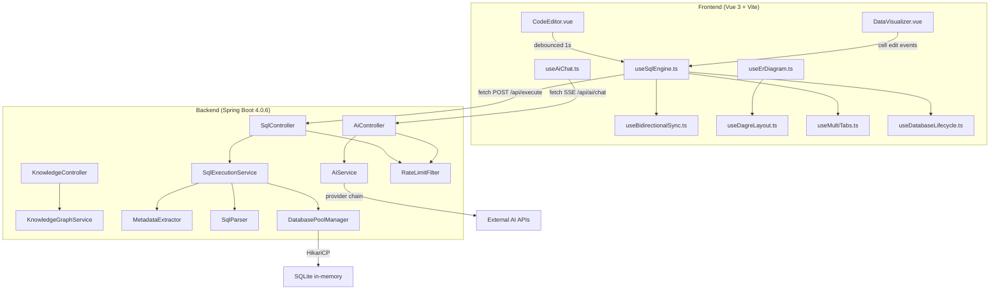

<!-- generated-by: gsd-doc-writer -->

# Architecture

## System overview

Sqlive is a full-stack SQL playground with a layered architecture: a Vue 3 browser-based code editor communicates with a Spring Boot backend over HTTP, which executes SQL against per-user in-memory SQLite databases and returns full schema snapshots. The system follows a **clear-and-re-execute** model -- each request either resets the database and executes the entire user script, or appends new statements to the existing state. Cell edits in the visualizer reverse-engineer SQL changes (UPDATE, INSERT, DELETE, CREATE TABLE, DROP TABLE) and re-execute. The architecture is split across two runtimes: a Node.js Vite dev server for the frontend and a Java 21 Spring Boot application for the backend.

## Component diagram



## Data flow

A typical SQL execution request flows through the system as follows:

1. **User types SQL** in `CodeEditor.vue`, which emits code changes to `useSqlEngine.ts`.
2. **Debounce** -- `useSqlEngine.ts` waits 100ms after the last keystroke (via `useDebounceFn` from VueUse, or 50ms in e2e mode), then fires `executeSqlRemote()`.
3. **HTTP request** -- The frontend sends `POST /api/execute` with the full SQL script, an optional `dbName`, and a `reset` flag derived from `useDatabaseLifecycle.ts`. The `reset` flag is `true` on the first execution for a given database name (sets up a fresh in-memory DB) and on explicit submits.
4. **Rate limiting** -- `RateLimitFilter` checks the per-IP counter for `/api/execute` (500 req/min). If exceeded, returns HTTP 429.
5. **Controller** -- `SqlController` validates the request, extracts `dbName` (defaults to `"default"`), and delegates to `SqlExecutionService.execute(script, dbName, reset)`.
6. **Database provisioning** -- `DatabasePoolManager.getOrCreateJdbcTemplate(dbName)` returns or creates a named SQLite in-memory database via `jdbc:sqlite:file:{name}?mode=memory` with a HikariCP pool (max 1 connection, max 20 databases).
7. **Reset (if needed)** -- On `reset=true`, `clearDatabase()` drops all user-created tables, views, and triggers (anything in `sqlite_master` not matching `sqlite_%`).
8. **Statement parsing** -- `SqlParser.parseStatementsPrecise()` splits the script into individual `SqlStatement` objects, tracking quote state, `BEGIN`/`END` depth, and `CASE`/`END` depth.
9. **Statement execution** -- Each statement is executed sequentially via `JdbcTemplate.execute()`. Query results (SELECT statements) are captured via `MetadataExtractor.extractTableSchema()` and appended to a `queryResults` list.
10. **Metadata collection** -- After all statements run, `MetadataExtractor` queries `sqlite_master` and `PRAGMA` tables to collect: table schemas (with column types and data), indexes, views, triggers, foreign keys, and execution metadata (duration, statement count).
11. **Response** -- `SqlResponse.DataPayload` wraps the complete database state and returns as JSON to the frontend.
12. **State update** -- `useSqlEngine.ts` replaces `db.tables`, `db.queryResults`, `db.indexes`, etc. with the response data. Rows are assigned deterministic `_highlightId` hashes for change detection. New or modified rows trigger flash animations.

**Error flow:** If any statement fails, `SqlExecutionService` catches the exception, removes the `[SQLITE_ERROR]` prefix, uses `SqlParser.locateErrorLine()` to map the error to a line number, and returns `SqlResponse.error(message, line)`. On the frontend, `useSqlEngine.ts` sets `executionError`, and if the mode was `reconciling` (cell edit in progress), transitions to `rollback` and restores `lastValidCode`.

**AI chat flow:** The AI flow is separate. `AiController` exposes endpoints at `/api/ai/chat` (streaming SSE), `/api/ai/analyze-error`, `/api/ai/fix-code`, `/api/ai/explain`, and `/api/ai/optimize`. `AiService` selects the configured provider (DeepSeek by default), builds a mode-specific system prompt via `PromptBuilder`, and routes to the provider's `streamChat()` or `complete()` implementation. Provider implementations (`DeepSeekProtocol`, `OllamaProtocol`, `LmStudioProtocol`, `OpenAiProtocol`) handle vendor-specific API formats and SSE parsing.

## Key abstractions

| Abstraction | Location | Description |
|---|---|---|
| `useSqlEngine()` | `sqlive-frontend/src/composables/useSqlEngine.ts` | Central state machine managing SQL execution lifecycle, error handling, bidirectional sync, and multi-tab coordination. Modes: `user`, `reconciling`, `rollback`. |
| `useBidirectionalSync()` | `sqlive-frontend/src/composables/useBidirectionalSync.ts` | Reverse-engineers cell edits into SQL statements -- updates VALUES tuples in INSERT statements, deletes rows, creates/drops tables. Maintains `lastValidCode` for rollback. |
| `DatabaseModel` | `sqlive-frontend/src/model/DatabaseTypes.ts` | The canonical frontend data model: `tables[]`, `queryResults[]`, `indexes[]`, `views[]`, `triggers[]`, `foreignKeys[]`, `metadata`. |
| `SqlExecutionService` | `sqlive-backend/.../service/SqlExecutionService.java` | Orchestrates SQL execution: parse statements, execute each, collect metadata. The single entry point for all SQL operations from frontend. |
| `DatabasePoolManager` | `sqlive-backend/.../service/database/DatabasePoolManager.java` | Manages per-user SQLite in-memory databases as `ConcurrentHashMap<String, JdbcTemplate>`. Caps at 20 databases with first-entry eviction (ConcurrentHashMap iterator, no access-order guarantee). Uses HikariCP for connection pooling. |
| `SqlParser` | `sqlive-backend/.../service/sql/SqlParser.java` | Precise SQL statement splitter that tracks quote state (`'string'`, `"identifier"`), `BEGIN`/`END` depth, and `CASE`/`END` depth. Returns `SqlStatement(sql, startLine)` records. |
| `MetadataExtractor` | `sqlive-backend/.../service/metadata/MetadataExtractor.java` | Collects full database metadata from `sqlite_master` and `PRAGMA` tables: tables with data, indexes, views, triggers, foreign keys. |
| `AiProvider` | `sqlive-backend/.../service/ai/AiProvider.java` | Interface for AI backends: `complete()` for non-streaming analysis, `streamChat()` for streaming SSE chat. Implemented by `OpenAiCompatibleProvider` with protocol-specific adapters. |
| `AiService` | `sqlive-backend/.../service/ai/AiService.java` | Manages AI provider lifecycle, builds mode-specific prompts via `PromptBuilder`, routes requests, parses JSON responses. |
| `RateLimitFilter` | `sqlive-backend/.../config/RateLimitFilter.java` | Servlet filter providing per-IP, per-endpoint rate limiting with sliding 60-second windows. AI: 100 req/min, SQL: 500 req/min. |

## Directory structure rationale

```
sqlive/
├── sqlive-frontend/          # Vue 3 browser client
│   ├── src/
│   │   ├── assets/           # Static assets (default SQL, CSS)
│   │   ├── components/       # Vue components
│   │   │   ├── ai-elements/  # AI chat UI elements (conversation, messages, prompt input)
│   │   │   ├── chart/        # ECharts integration (option builder, theme, composable)
│   │   │   ├── er/           # ER diagram components (ErDiagram, ErTableNode, search/toolbar)
│   │   │   ├── knowledge/    # Knowledge graph UI (LearningCompanion, KnowledgeDetail, KnowledgePanel)
│   │   │   └── ui/           # Reka-ui v2 primitives (button, dialog, dropdown, etc.)
│   │   ├── composables/      # Stateful logic (useSqlEngine, useAiChat, useErDiagram, etc.)
│   │   ├── model/            # TypeScript type definitions (DatabaseTypes, ApiTypes, SchemaTypes)
│   │   ├── utils/            # Pure utility functions (SQL parsing, SSE, file I/O, formatting)
│   │   └── __tests__/        # Vitest unit + component tests, mirroring src/ structure
│   ├── tests/e2e/            # Playwright end-to-end tests
│   ├── vite.config.ts        # Vite build config, Vitest integration
│   └── package.json          # Dependencies and scripts
├── sqlive-backend/           # Spring Boot API server
│   └── src/
│       ├── main/java/com/douzi/sqlive/
│       │   ├── config/       # Spring config (WebConfig with CORS, RateLimitFilter, AiProperties)
│       │   ├── controller/   # REST controllers (SqlController, AiController, KnowledgeController, HealthController)
│       │   ├── dto/          # Request/response data objects (SqlRequest, SqlResponse, AI DTOs, schema DTOs)
│       │   │   └── ai/       # AI-specific DTOs (AiChatRequest, AiChatResponse, StreamChunk)
│       │   ├── exception/    # GlobalExceptionHandler and custom exceptions
│       │   └── service/      # Business logic
│       │       ├── ai/       # AI provider interface, protocol implementations, PromptBuilder
│       │       ├── database/ # DatabasePoolManager (SQLite per-user pooling)
│       │       ├── knowledge/# KnowledgeGraphService (static topic graph)
│       │       ├── metadata/ # MetadataExtractor (schema introspection)
│       │       └── sql/      # SqlParser (statement splitting with depth tracking)
│       ├── main/resources/   # application.yml, knowledge-graph.json
│       └── test/java/        # JUnit 5 tests (mirroring main/java/ structure)
├── .planning/                # GSD planning artifacts (out of scope for this doc)
├── CLAUDE.md                 # Project instructions and conventions
└── docs/                     # Documentation (this file)
```

The frontend follows Vue 3 composition API conventions: composables in `src/composables/` encapsulate stateful logic, components in `src/components/` handle rendering, `model/` holds shared type definitions, and `utils/` contains pure functions. The backend follows standard Spring Boot layered architecture: controllers handle HTTP, services contain business logic, and repository-like classes (`DatabasePoolManager`, `MetadataExtractor`, `SqlParser`) manage data access and processing. DTOs are separated into `dto/` with an `ai/` sub-package for AI-specific payloads. The `config/` package centralizes cross-cutting concerns (CORS, rate limiting, AI properties).
